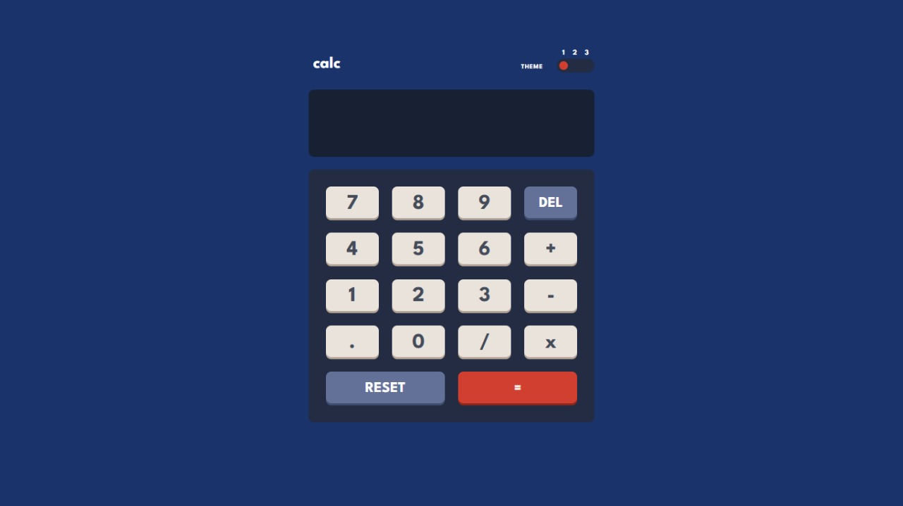
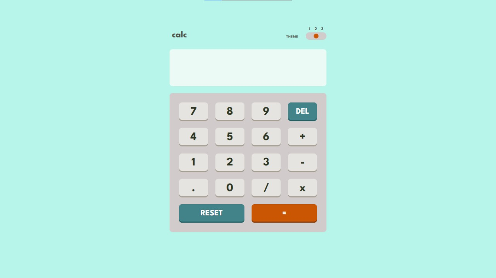
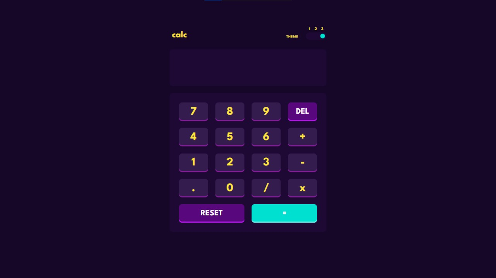
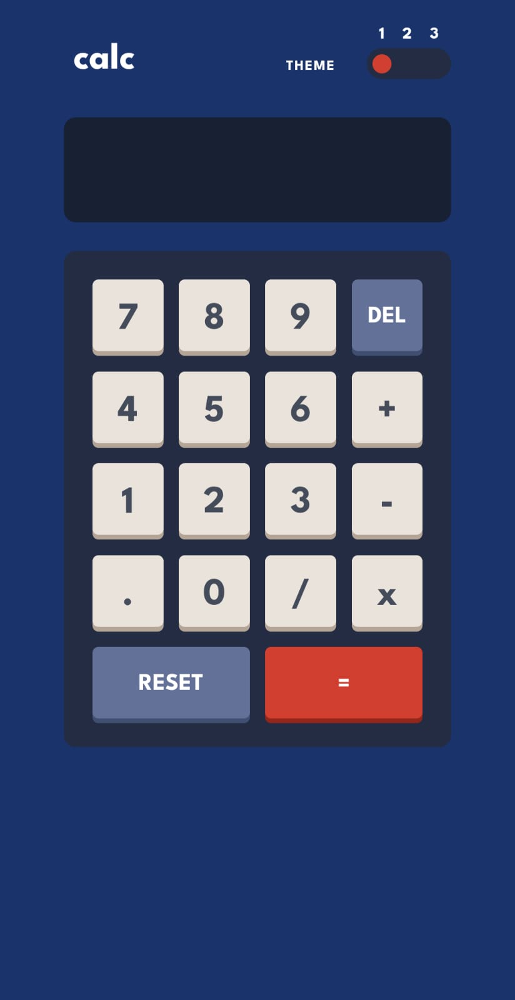
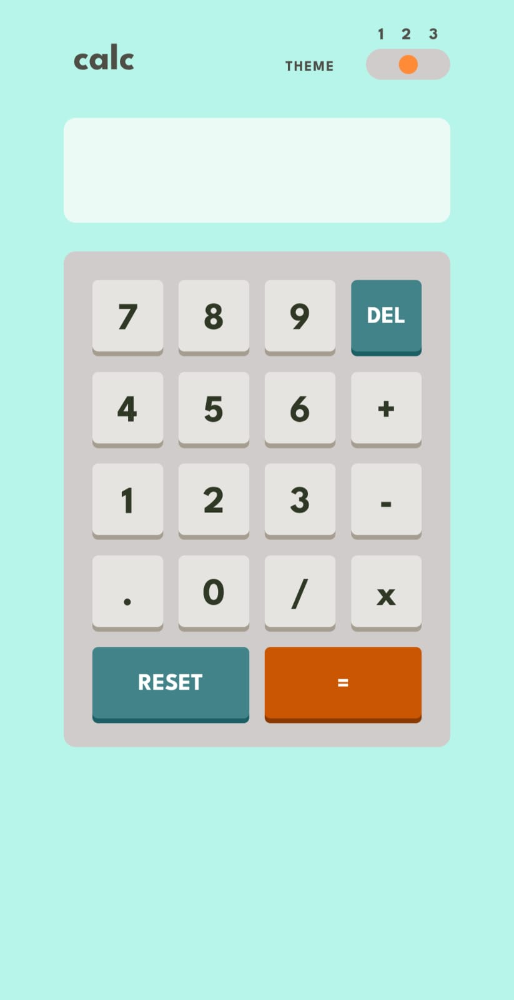
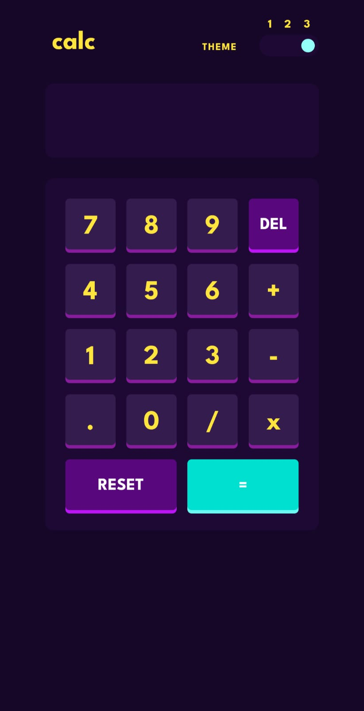

# 🧮 Calculator App  

This project was developed as part of my **CodeAlpha Internship**.  
It is a simple yet elegant **calculator web application** built with **HTML, CSS, and JavaScript**.  
The app allows users to perform basic arithmetic operations with a clean, responsive interface and multiple theme options.  

---

## ✨ Features  

- Basic arithmetic operations ➕➖✖️➗  
- Responsive and clean UI  
- Multiple Themes 🎨  
  - 🌿 Light Mint (default)  
  - 🌌 Dark Blue  
  - 💜 Purple  
- Theme preference saved in **Local Storage**  
- Smooth theme switching  

---

## 🚀 Live Demo  

🔗 [View Live Project](https://calculator-app-green-five.vercel.app/)  
🔗 [GitHub Repository](https://github.com/saumya-singh-1/calculator-app_CodeAlpha)  

---

## 🛠️ Built With  

- [HTML5](https://developer.mozilla.org/en-US/docs/Web/HTML)  
- [CSS3](https://developer.mozilla.org/en-US/docs/Web/CSS)  
- [JavaScript](https://developer.mozilla.org/en-US/docs/Web/JavaScript)  

---

## 📸 Screenshots  

### Dark Blue Theme (Default)
  

### Light Theme  

### Purple Theme  
  

### Mobile View (Dark Blue Theme)
  

### Mobile View (Light Theme)

### Mobile View (Purple Theme)

---

## 👨‍💻 Author  

- **Saumya Singh**  
  GitHub: [@saumya-singh-1](https://github.com/saumya-singh-1)  
  LinkedIn: [@saumyasingh](www.linkedin.com/in/saumya-singh-0256b5378/)  

---

## 🎯 Internship Note  

This project was built as part of the **CodeAlpha Internship Program (2025)**.  
It helped me practice **JavaScript functionality, theme switching with CSS variables, and responsive design principles**.  
